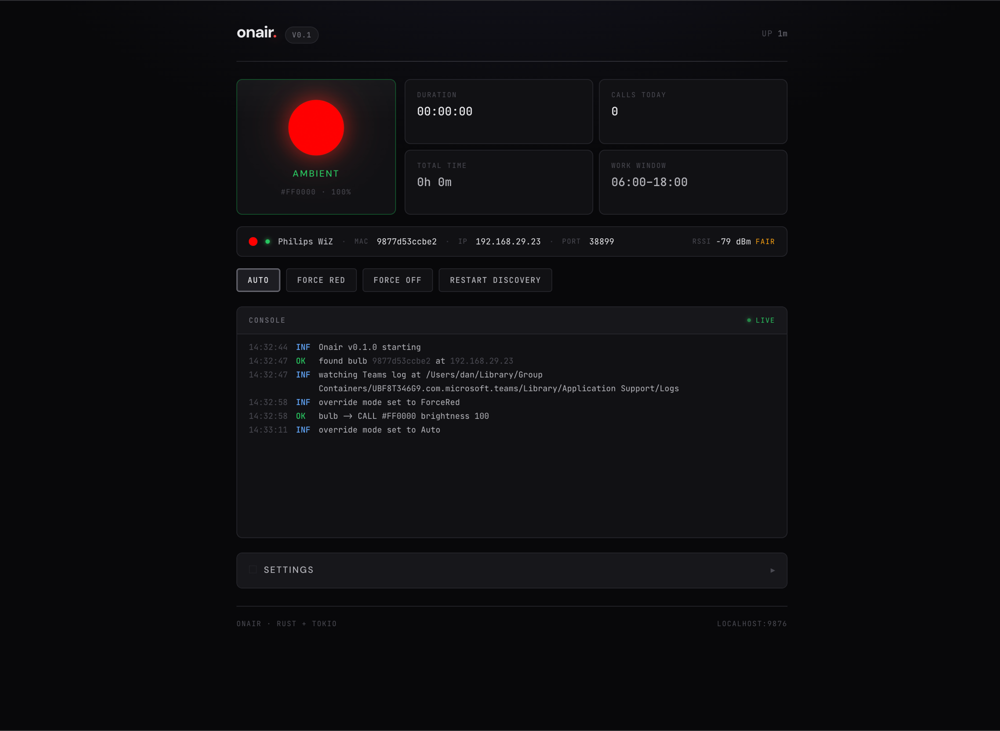
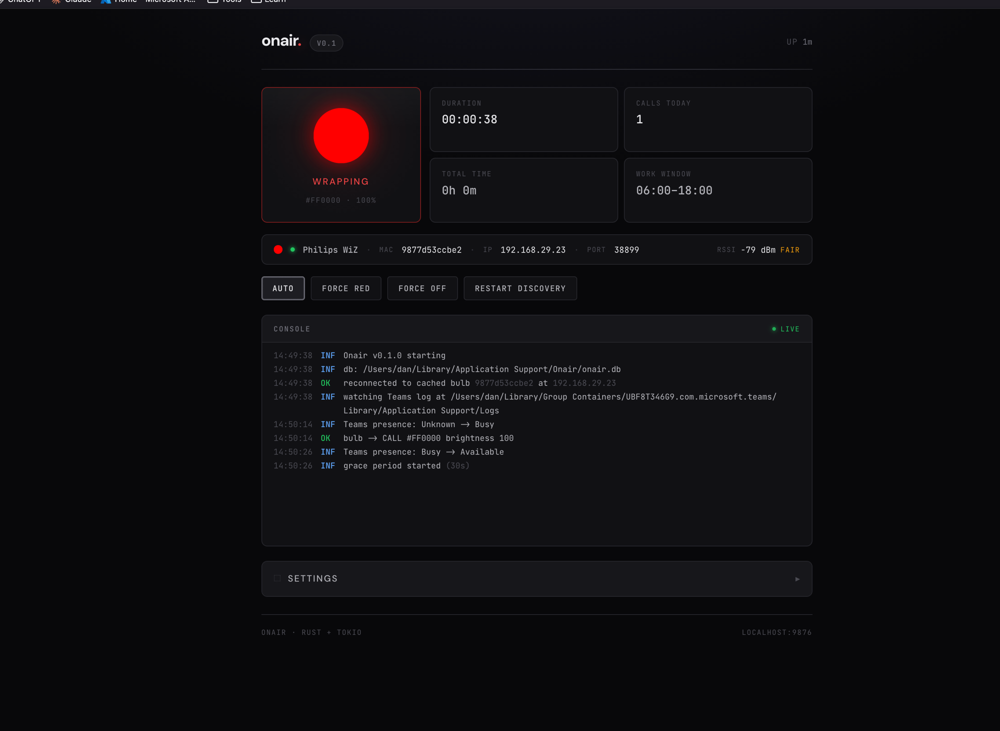

# onair

> A small Rust binary that turns a Philips WiZ smart bulb red whenever you're on a Microsoft Teams call. Mount it somewhere visible at home and your family stops wondering whether they can interrupt you.



No cloud. No Microsoft Graph API. No phone app middleman. Just a single binary on your laptop that watches Teams' own log file and speaks UDP directly to the bulb on your home network.

---

## Features

- **Auto-detects Teams call status** by tailing the local `MSTeams_*.log` file. No auth, no permissions, no Graph API.
- **Drives a Philips WiZ bulb** over local UDP (port 38899). Discovery is automatic; you can also pin a known IP.
- **Cross-platform** — macOS, Windows, Linux. Single statically-linked binary, no runtime dependencies.
- **Local web dashboard** at `http://localhost:9876`:
  - Live beacon that mirrors the bulb's actual color (read back via `getPilot`)
  - Console with the live event stream
  - Settings: bulb selection, work hours, grace period, color/brightness for call vs. idle states, manual override
- **Configurable work hours** so it doesn't trigger after-hours
- **Grace period** (default 10s) so back-to-back calls don't cause the bulb to flicker off-on-off
- **Manual override** — Force Red / Force Off / Auto buttons, useful for "I'm in a deep-work session, leave me alone"
- **SQLite persistence** — all settings + call history survive restart
- **First-run convenience** — if exactly one WiZ bulb is on your LAN at startup, it's auto-selected

---

## Demo

Idle, no call:


Mid-call wrap-down (the spinner ring shows the grace timer counting down):



---

## Install

### Pre-built binaries

Download from the [Releases page](https://github.com/dannotes/onair/releases) for your OS:

- **macOS** — Apple Silicon (`onair-aarch64-apple-darwin.tar.gz`) or Intel (`onair-x86_64-apple-darwin.tar.gz`)
- **Windows** — `onair-x86_64-pc-windows-msvc.zip`
- **Linux** — `onair-x86_64-unknown-linux-gnu.tar.gz`

Extract and run. There are no dependencies — the binary is fully self-contained.

### Build from source

You'll need [Rust](https://rustup.rs/) (stable, 1.75+):

```bash
git clone https://github.com/dannotes/onair.git
cd onair
cargo build --release
./target/release/onair
```

The release binary is around 5–8 MB depending on platform.

---

## Quick start

1. Run the binary — `onair` (or `onair.exe` on Windows).
2. Open `http://localhost:9876` in your browser.
3. If your WiZ bulb is on the same LAN and powered on, it gets auto-selected on first run. Otherwise expand **Settings → Bulb Selection → Scan Network** and click your bulb.
4. Done. The bulb will turn red the next time Teams shows you as Busy or Do Not Disturb.

That's it. The defaults are sensible and there's nothing else to configure unless you want to.

---

## How it works

```
┌─────────────────────┐                        ┌──────────────┐
│  your laptop        │ ─── UDP 38899 ──────►  │  WiZ Bulb    │
│                     │                        │  (on the LAN)│
│  onair binary       │  ◄── getPilot reply ── └──────────────┘
│                     │
│  - tails Teams log  │           HTTP
│  - drives the bulb  │  ◄────────────────────  your browser
│  - serves dashboard │     localhost:9876
│  - SQLite config    │
└─────────────────────┘
```

The state machine:

```
                              busy / dnd
   ┌──────────────┐  ──────────────────────►  ┌──────────────┐
   │  available   │                           │  on a call   │
   │  bulb off    │  ◄─────────────────────── │  bulb red    │
   └──────────────┘   available + grace 10s   └──────────────┘
          ▲                                            │
          │                                            │
          └────────── if back to busy within ──────────┘
                       grace, stay red
                       (back-to-back calls)
```

A small monitor task polls the latest `MSTeams_*.log` every 3 seconds (configurable), reads only new bytes since the last poll, and watches for presence transitions. Independently, a second task polls the bulb's `getPilot` every 5 seconds so the dashboard beacon shows the bulb's *actual* color, not a guess.

When Teams flips Busy → Available, a 10 second grace timer starts. If you go busy again within that window, the bulb stays red. Otherwise the timer expires and the bulb turns off (or whatever you've configured for "When Not on a Call").

---

## Configuration

Everything is editable from the dashboard's **Settings** panel. There's no config file you need to touch by hand.

| Setting | Default | What it does |
|---|---|---|
| Work Start / End | 06 / 18 | Hour-of-day window. Outside these hours new presence transitions are ignored, but an *active* call keeps the bulb red until it actually ends. |
| Poll Interval | 3 s | How often to check the Teams log for new presence events |
| Grace Period | 10 s | How long to wait after busy → available before turning the bulb off |
| Max Call Cap | 4 hours | Safety cap. If the bulb stays red for this long (e.g. Teams crashed), revert to idle. |
| Teams Offline | 5 min | If the Teams log hasn't been written to for this long, treat Teams as offline and turn the bulb off |
| When On a Call | red @ 100% | Color and brightness — or off, if you want an inverted setup |
| When Not on a Call | off | Color/brightness or off. Set to a warm white if you want an always-on ambient lamp. |
| UI Port | 9876 | Dashboard port (restart required) |

Config and call history are stored in a small SQLite database at:

- **macOS**: `~/Library/Application Support/Onair/onair.db`
- **Windows**: `%APPDATA%\Onair\onair.db`
- **Linux**: `~/.config/onair/onair.db`

You can delete this file at any time — the next run will recreate it with defaults and re-detect your bulb.

---

## Cross-platform notes

| OS | Status | Default Teams log path |
|---|---|---|
| **macOS** | Verified | `~/Library/Group Containers/UBF8T346G9.com.microsoft.teams/Library/Application Support/Logs/` |
| **Windows** | Believed correct (per Microsoft's spec for the new Teams) | `%LOCALAPPDATA%\Packages\MSTeams_8wekyb3d8bbwe\LocalCache\Microsoft\MSTeams\Logs\` |
| **Linux** | Best-effort guess | `~/.config/Microsoft/Microsoft Teams/logs/` |

Teams logs the user's status differently per platform:

- **Windows** writes lines like `... TaskbarBadgeServiceLegacy: ... GlyphBadge{"busy"} ...`
- **macOS** writes lines like `... UserDataCrossCloudModule: CloudStateChanged: ... { availability: Busy, ... }`

`onair` has a separate regex per OS that normalizes both to the same internal `Presence` enum.

If your Teams installs the log somewhere else, open Settings, paste the path into **Teams Log Path**, click **Verify**, and `onair` will check that the directory contains real log files and confirm the parser can find a presence event in them.

---

## Run on startup

Drop-in templates for all three OSes live in [`dist/autostart/`](dist/autostart/). Pick your platform and follow the README in that folder — it's a 30-second copy-paste:

| OS | Mechanism | File |
|---|---|---|
| macOS | launchd LaunchAgent | [`dist/autostart/macos/com.dannotes.onair.plist`](dist/autostart/macos/com.dannotes.onair.plist) |
| Linux | systemd user unit | [`dist/autostart/linux/onair.service`](dist/autostart/linux/onair.service) |
| Windows | Startup folder shortcut (PowerShell installer) | [`dist/autostart/windows/install-startup.ps1`](dist/autostart/windows/install-startup.ps1) |

Quick start (macOS, assuming you installed via Homebrew):

```bash
cp dist/autostart/macos/com.dannotes.onair.plist ~/Library/LaunchAgents/
launchctl load ~/Library/LaunchAgents/com.dannotes.onair.plist
```

Quick start (Linux):

```bash
mkdir -p ~/.config/systemd/user
cp dist/autostart/linux/onair.service ~/.config/systemd/user/
systemctl --user daemon-reload
systemctl --user enable --now onair
```

Quick start (Windows, in PowerShell):

```powershell
.\dist\autostart\windows\install-startup.ps1
```

See [`dist/autostart/README.md`](dist/autostart/README.md) for full instructions, log locations, and how to uninstall.

---

## API

The dashboard is just a thin client on top of a small JSON API. You can hit it directly with `curl`:

| Method | Path | Purpose |
|---|---|---|
| `GET`  | `/`                  | the embedded dashboard HTML |
| `GET`  | `/api/status`        | full live snapshot — presence, bulb state, override, stats |
| `GET`  | `/api/logs`          | event ring buffer (`?limit=&offset=`) |
| `GET`  | `/api/config`        | current config |
| `POST` | `/api/config`        | partial config update |
| `POST` | `/api/override`     | `{"mode": "auto" \| "force_red" \| "force_off"}` |
| `POST` | `/api/discover`      | trigger LAN bulb discovery |
| `POST` | `/api/bulb/select`   | `{"mac": "...", "ip": "optional"}` |
| `GET`  | `/api/bulb/state`    | cached `getPilot` snapshot |
| `POST` | `/api/bulb/test`     | `{"mode": "call" \| "idle"}` — flash bulb in that mode for 3 s |
| `POST` | `/api/teams/verify`  | verify a Teams log directory works |
| `GET`  | `/api/calls`         | call history (`?days=`) |

---

## Tech stack

- [Rust](https://www.rust-lang.org/) 2021, async with [Tokio](https://tokio.rs/)
- [Axum](https://github.com/tokio-rs/axum) for the web layer
- [rusqlite](https://github.com/rusqlite/rusqlite) (bundled) for persistence
- Vanilla HTML + CSS + JS for the dashboard — no framework, no build step. Embedded in the binary via `include_str!`.

The whole project compiles to a single binary with zero runtime dependencies.

---

## Credits

- Fonts: [DM Sans](https://fonts.google.com/specimen/DM+Sans) (headings) and [JetBrains Mono](https://fonts.google.com/specimen/JetBrains+Mono) (everything else), via Google Fonts.
- The WiZ UDP protocol has been documented by various community efforts; this implementation works against off-the-shelf WiZ bulbs with no firmware modification.

---

## License

[MIT](LICENSE) — do whatever you want with it.

---

## Contributing

Issues and PRs welcome. Two things would help most right now:

1. **Verify the Windows path + `GlyphBadge` regex** against a real Windows Teams installation. The defaults are believed-correct from the Microsoft spec but unverified on real hardware.
2. **Verify or update the Linux path** — Teams on Linux is uncommon and may have moved.

If your default doesn't work, the manual path override + Verify button in Settings is the workaround in the meantime.
